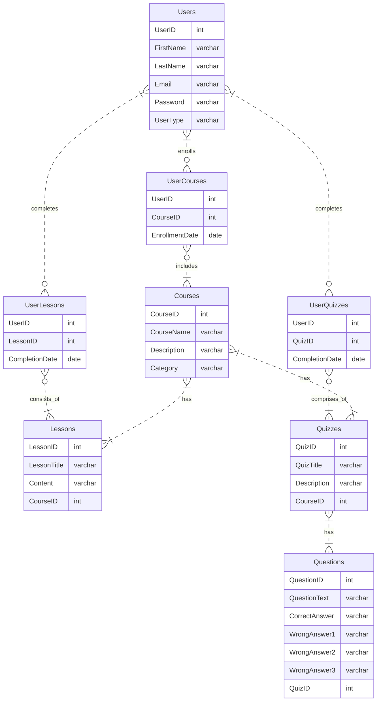

# GADCW
GAD coursework project at uni.

## ER of the database we use.

```mermaid
  erDiagram
      Users {
          UserID int
          FirstName varchar
          LastName varchar
          Email varchar
          Password varchar
          UserType varchar
      }

      Courses {
          CourseID int
          CourseName varchar
          Description varchar
          Category varchar
      }

      Lessons {
          LessonID int
          LessonTitle varchar
          Content varchar
          CourseID int
      }

      Quizzes {
          QuizID int
          QuizTitle varchar
          Description varchar
          CourseID int
      }

      Questions {
          QuestionID int
          QuestionText varchar
          CorrectAnswer varchar
          WrongAnswer1 varchar
          WrongAnswer2 varchar
          WrongAnswer3 varchar
          QuizID int
      }

      UserCourses {
          UserID int
          CourseID int
          EnrollmentDate date
      }

      UserLessons {
          UserID int
          LessonID int
          CompletionDate date
      }

      UserQuizzes {
          UserID int
          QuizID int
          CompletionDate date
      }

      Users }|..o{ UserCourses : enrolls
      UserCourses }o..|{ Courses : includes
      Users }|..o{ UserLessons : completes
      UserLessons }o..|{ Lessons : consists_of
      Users }|..o{ UserQuizzes : completes
      UserQuizzes }o..|{ Quizzes : comprises_of
      Courses }|..|{ Lessons : has
      Courses }|..|{ Quizzes : has
      Quizzes }|..|{ Questions : has

```
