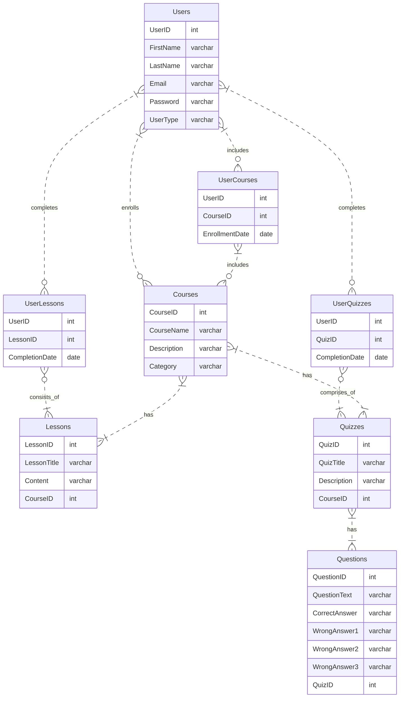

# GADCW
GAD coursework project at uni.

## ER of the database we use.


To set the default properties of the MetroForms, <b> add this code in the constructor of your form or in a method that runs when the form loads.</b>
```cs
// Set the BackColor property
this.BackColor = Color.FromArgb(40, 40, 40);

// Set the ForeColor property
this.ForeColor = Color.White;

// Set the Font property
this.Font = new Font("Segoe UI", 9F, FontStyle.Regular, GraphicsUnit.Point, ((byte)(0)));

// Set the Style property
this.Style = MetroFramework.MetroColorStyle.Black;

// Set the Theme property
this.Theme = MetroFramework.MetroThemeStyle.Dark;

```
